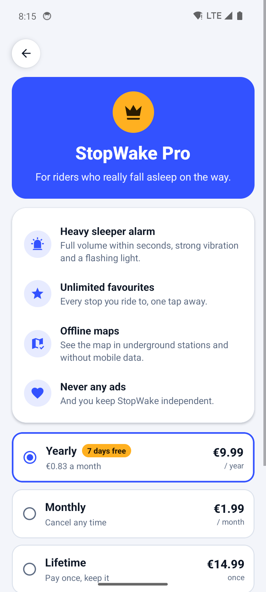
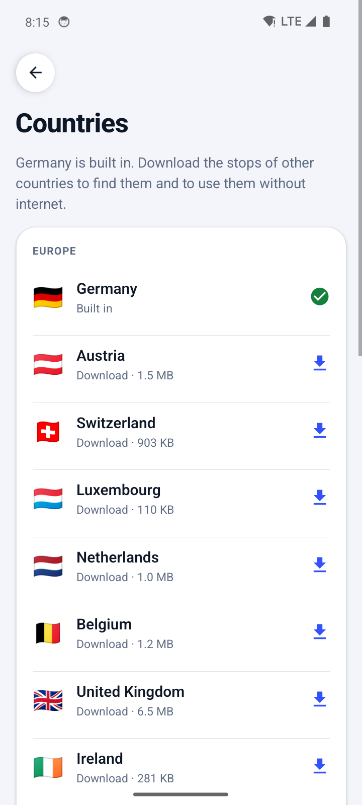
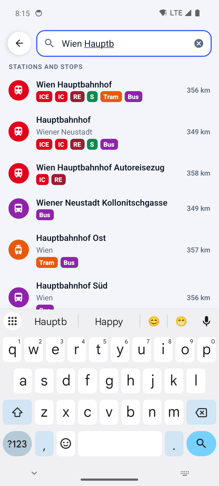
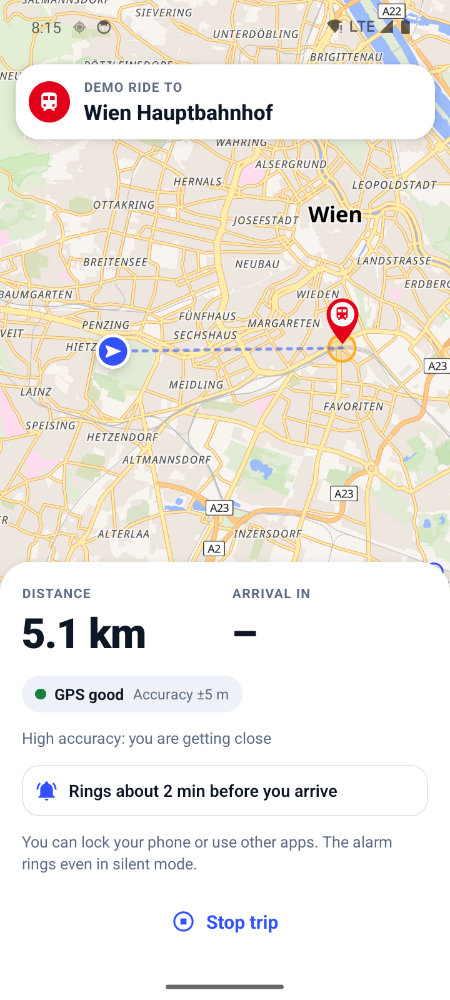

# StopWake (working name)

A location alarm that never lets you miss your stop. Pick a stop on the map, fall asleep on the
train or bus, and the phone wakes you before you get there, even in silent mode and with the
screen locked.

Built for Germany first: every bus, tram, U-Bahn, S-Bahn and train stop is on the map and in
the search, offline. Stops for 16 more countries download in the app: Austria, Switzerland and
Luxembourg (wave 1); the Netherlands, Belgium, the UK, Ireland, Sweden, Norway, Denmark and
Finland (wave 2); France (wave 3); the USA, Canada, Australia and Japan (wave 4). Android first;
iOS follows with v1.1 and matters most for wave 4, where most riders use iPhones.

## Status

The core engine milestone (reliable tracking, trigger rules, GPS watchdog, alarm) plus the
Germany release UI: a real map, all stops, two-tap alarms and three languages. The plan's gate
before launch is still **20 real trips with zero missed stops**.

| Works now | Not yet |
| --- | --- |
| Map of Germany with every stop (about 272,000), coloured by type and named on the map | Commute schedules, multi-stop trips, sharing your arrival, watch (next for Pro) |
| 16 more countries as in-app downloads, built monthly from OpenStreetMap | Hard-to-dismiss challenges (type the stop name, shake) |
| Tap a stop, then **Start alarm**: two taps | iOS (AlarmKit), needed for wave 4 |
| Offline stop search across all installed countries: *Muenchen*, *München*, *Munchen*, *Hbf*, *Str.* | Own map and geocoder servers (uses the public OpenFreeMap and Photon) |
| Address search worldwide, long-press anywhere to drop a pin | Play Store signing key, Play Console products and the RevenueCat key |
| Wake by distance (100 m – 2 km) or time (1–15 min before) | Ads for free users (planned about three months after launch) |
| Trains and S-Bahn default to minutes, with a warning when 100–200 m is too short | |
| 11 languages: Dansk, Deutsch, English, Français, Italiano, Nederlands, Norsk, Suomi, Svenska, हिन्दी, 日本語 | |
| Live trip map with your trail and heading; an estimated position (≈) when GPS is lost underground | |
| Demo ride: a simulated trip to any stop, to see the map move and hear the alarm | |
| Offline map download (25 km around you) and a 256 MB map cache | |
| Full-screen lock-screen alarm that rings in silent mode; Gentle / Normal / Heavy sleeper | |
| StopWake Pro through Google Play: yearly with a 7-day trial, monthly, lifetime | |
| Favourites, recents, setup checklist with a test alarm, shareable trip log | |

## Screenshots

From the release APK on an Android 14 emulator, taken by the **Screenshots** workflow while it
rides a simulated trip through Munich, then shows Pro, the Countries screen, Austria downloaded
and searched, and a demo ride into Wien Hauptbahnhof (see `e2e/`).

<p>
  
  
  
  
</p>
<p>
  
  
  
  
</p>
<p>
  
  
  
  
</p>
<p>
  
  
  
  
</p>

## Try it on a phone

1. Open the latest **Android** run under the repo's **Actions** tab and download the **StopWake-apk** artifact.
2. Unzip it and install the APK (allow installs from unknown sources when asked).
3. On first launch, pick your language, then fix everything the setup checklist marks red and play the test alarm.
4. Tap a stop on the map (or search for it) and press **Start alarm**.
5. After each real trip, use **Share trip log** on the last screen. The logs are what we tune on.

## How it works

```
 App (Expo / React Native)                Native Android (modules/trip-alarm)
 ─────────────────────────                ────────────────────────────────────
 Map (MapLibre, OpenFreeMap)              TripService  (foreground service, type "location")
 Stops DBs (SQLite, offline) ─ startTrip ▶  │  GPS + network fixes (LocationManager)
 Search, sheet, live trip    ◀─ events ──   ▼
 11 languages, Pro (RevenueCat)           TripEngine  (pure Kotlin, unit tested)
                                            │  trigger rules · adaptive rate · watchdog
                                            ▼
                                          AlarmPlayer + AlarmActivity  (texts in 11 languages)
                                            alarm stream, escalating, over the lock screen
```

Everything that decides when to ring runs natively, inside a foreground service that keeps
working with the app closed. JavaScript draws the screens. There is no backend; nothing leaves
the phone except map tiles and address searches. Stop search and the stops on the map come from
a database inside the app, so picking a stop works without a connection.

**Permissions.** The trip starts while the app is open, so Android grants location to the
service with plain *while using the app* permission. The app never asks for background
("all the time") location, which avoids the Play Store's background-location review.

### Stops

`npm run build:stations` turns the [db-hafas-stations](https://github.com/derhuerst/db-hafas-stations)
list (DB InfraGO and OpenStreetMap data) into `assets/stations/germany-stops.db`, a 20 MB SQLite
file with a full-text index. Entries with the same name within 400 m are merged into one stop.
Each stop keeps its transport types (ICE, IC, RE/RB, S, U, tram, bus, ferry) and a rank based on
how busy it is. The rank decides which stops show at low zoom and breaks ties in search together
with the distance from you. The file is generated, not committed: run the script after
`npm install`, and CI runs it before every build.

### Countries outside Germany

The **Stop packs** workflow (monthly, or from the Actions tab for chosen packs) builds one
SQLite pack per country, or per region for the USA, from [Geofabrik](https://download.geofabrik.de)'s
OpenStreetMap extracts:

1. `osmium tags-filter` keeps route relations, stop areas, stops and town names.
2. `tools/osm-stops.py` lists every named stop element with the lines that stop there.
3. `tools/build-osm-pack.ts` merges platforms, stop positions and the parts of a station (its
   stop area) into one stop, names local stops after their town ("Karlsplatz, Wien"), ranks
   stops by the lines that serve them, and writes the same format as the Germany database
   (shared writer: `tools/stops-db.ts`). Where riders say S-Bahn and U-Bahn (Austria,
   Switzerland, Luxembourg, Denmark's S-tog) the badges say so; elsewhere they say Train and Metro.
4. The packs are gzipped and published with `packs.json` (sizes, counts, build dates) to the
   `stop-packs` release.

| Wave | Pack | Stops | Download |
| --- | --- | ---: | ---: |
| – | 🇩🇪 Germany (in the app) | 272,635 | – |
| 1 | 🇦🇹 Austria | 36,244 | 1.5 MB |
| 1 | 🇨🇭 Switzerland | 24,657 | 901 KB |
| 1 | 🇱🇺 Luxembourg | 2,773 | 110 KB |
| 2 | 🇳🇱 Netherlands | 29,648 | 1.0 MB |
| 2 | 🇧🇪 Belgium | 31,367 | 1.2 MB |
| 2 | 🇬🇧 United Kingdom | 180,352 | 6.5 MB |
| 2 | 🇮🇪 Ireland | 7,616 | 282 KB |
| 2 | 🇸🇪 Sweden | 32,970 | 1.2 MB |
| 2 | 🇳🇴 Norway | 51,916 | 1.8 MB |
| 2 | 🇩🇰 Denmark | 8,801 | 325 KB |
| 2 | 🇫🇮 Finland | 80,172 | 2.6 MB |
| 3 | 🇫🇷 France | 143,820 | 5.6 MB |
| 4 | 🇺🇸 USA: Northeast | 37,827 | 1.3 MB |
| 4 | 🇺🇸 USA: Midwest | 51,201 | 1.7 MB |
| 4 | 🇺🇸 USA: South | 63,272 | 2.3 MB |
| 4 | 🇺🇸 USA: West | 78,302 | 2.9 MB |
| 4 | 🇨🇦 Canada | 80,179 | 3.0 MB |
| 4 | 🇦🇺 Australia | 89,582 | 3.4 MB |
| 4 | 🇯🇵 Japan | 102,499 | 4.4 MB |

About 1.1 million stops outside Germany; packs are counted and sized from the latest build.

The app lists them under **Settings → Countries**, offers the right one on the map when you are
in (or look at) a country you have not downloaded, downloads and checks it, and then searches
all installed countries together and shows their stops on the map. Border stations that are in
two databases show once. The catalog of packs is `src/lib/stations/countries.ts`.

### When it rings (arrive mode)

The first of these wins:

1. A fix lands inside the radius.
2. Two consecutive fixes straddle the radius. At 300 km/h a train covers 415 m between fixes and can skip a small circle.
3. The estimated time of arrival drops below the "minutes before" setting.
4. You came close and are now moving away. This catches a pin placed off the actual route; the alarm offers **Not yet, keep tracking**.
5. GPS went quiet (tunnel, underground) and dead reckoning from the last speed says you have arrived. This alarm also offers **Not yet**.

Coarse cell-tower fixes cannot ring a small circle. For the minutes trigger they count only
when their error is worth under 30 seconds of travel. With **wake by time**, a 300 m circle
around the stop stays armed as a backstop.

### Tracking rate

| Distance to the stop | Fixes | Why |
| --- | --- | --- |
| Far (> 20 km and > 30 min) | GPS every 2 min, network every 1 min | Battery on long trips |
| Middle (5–20 km or < 30 min) | Every 30 s | ETA becomes meaningful |
| Near (< 5 km or < 15 min) | GPS every 5 s, CPU kept awake | Never overshoot the radius |

The "minutes before" setting moves these boundaries out. A watchdog notices when fixes stop
arriving. It runs on a Handler, backed by an AlarmManager alarm that also fires in doze or
after Android killed the app. If the app was killed or the phone rebooted mid-trip, you get a
"Tracking stopped" alarm instead of silence.

## Develop

```bash
npm install
npm run build:stations # generate the offline stops database (about 5 s)
npm run check          # typecheck, lint, JS tests (the search tests use the generated database)
npm run test:engine    # trip engine tests on the JVM, including 1000 simulated trips
npx expo run:android   # build and run on a connected phone (needs the Android SDK)
```

**On an emulator.** The **Screenshots** workflow (Actions tab, *Run workflow*) builds the app,
boots an Android emulator and drives it with [Maestro](https://maestro.dev) through `e2e/`:
first start, setup, map, search, a trip to München Hbf with a simulated GPS ride, the alarm,
settings and the other languages. It commits the screenshots to `docs/screenshots/`, and a failed
step leaves a `debug-*.png` of the screen it stopped on.

The engine tests need only a JDK. They compile the engine sources from the Android module and
replay synthetic trips with GPS noise, station stops and tunnels. Any change to the trigger
rules should keep them green, and a missed stop seen on a real trip should become a new scenario
in `TripEngineTest`.

**Languages.** The app's texts live in `src/i18n/*.ts`; `en.ts` defines the keys and every
other language must have every key with the same `{placeholders}` (a test checks this). The
alarm screen and notifications are drawn natively, so their texts are in `L10n.kt`. The app
sends the chosen language to the native side on start and whenever it changes.

```
App.tsx                      screen flow
src/screens/                 Onboarding, Home (map, sheet, search), Setup, Tracking, Done, Settings
src/map/                     home map, trip map, GeoJSON helpers
src/lib/stations/            stops databases: spelling rules, search, country catalog and packs
src/lib/                     address search, wake options, Pro, formatting, local storage
src/i18n/                    the 11 languages
src/ui/                      theme, colours, shared components
tools/build-stations.ts      builds assets/stations/germany-stops.db
tools/osm-stops.py, build-osm-pack.ts   build the country packs (see the Stop packs workflow)
e2e/                         emulator flows and the screenshot script (Maestro)
modules/trip-alarm/
  android/…/tripalarm/       TripService, AlarmPlayer, AlarmActivity, receivers, L10n, JS bridge
  android/…/engine/          TripEngine, SpeedEstimator, Geo (no Android imports)
  engine-tests/              JVM test project for the engine
  src/                       typed JS wrapper
```

## StopWake Pro

| Free | Pro |
| --- | --- |
| Every stop in every country, online and offline | Everything in Free |
| Wake by distance or time, Gentle and Normal alarms | Heavy sleeper alarm |
| Three favourites | Unlimited favourites |
| Demo ride, live trip map, map cache | Offline map download |
| | Never any ads; next: commute schedules, multi-stop trips, sharing your arrival, watch |

Prices (set in Play Console, shown from the store): **€9.99 a year with a 7-day free trial**
(CHF 11, £8.99, $9.99), €1.99 a month, €14.99 once for lifetime. The app reads the plans from
RevenueCat and unlocks Pro with its entitlement `pro`; it never hard-codes product ids.

To start selling:

1. **Play Console:** create the app, then the subscriptions (yearly with a 7-day free-trial
   offer, monthly) and a one-time product for lifetime, with local prices.
2. **RevenueCat:** create the project and its Android app, connect Play with a service account,
   import the three products, create the entitlement `pro` with all three attached, and a
   current offering with Annual, Monthly and Lifetime packages.
3. **GitHub:** add the RevenueCat *Android public SDK key* as the repository secret
   `REVENUECAT_ANDROID_KEY`. Builds made with it sell Pro; builds without it (like the test
   APKs so far) have Pro unlocked and show example prices.
4. Purchases only work in a build installed from Play (an internal testing track is enough),
   signed with your upload key.

## Data and credits

- Map © [OpenStreetMap](https://www.openstreetmap.org/copyright) contributors, tiles by
  [OpenFreeMap](https://openfreemap.org) using the OpenMapTiles schema.
- Stops: DB InfraGO AG ([CC BY 4.0](https://creativecommons.org/licenses/by/4.0/)) and
  OpenStreetMap contributors ([ODbL](https://opendatacommons.org/licenses/odbl/)), via
  db-hafas-stations.
- Stops outside Germany: © OpenStreetMap contributors ([ODbL](https://opendatacommons.org/licenses/odbl/)),
  extracts by [Geofabrik](https://download.geofabrik.de), rebuilt monthly.
- Address search: [Photon](https://photon.komoot.io) by Komoot.

The same credits are shown in the app under **Settings → About and data**.
