# StopWake (working name)

A location alarm that never lets you miss your stop. Pick a stop on the map, fall asleep on the
train or bus, and the phone wakes you before you get there, even in silent mode and with the
screen locked.

Built for Germany first: every bus, tram, U-Bahn, S-Bahn and train stop is on the map and in
the search, offline. Android first; iOS follows with v1.1 (see the product plan).

## Status

The core engine milestone (reliable tracking, trigger rules, GPS watchdog, alarm) plus the
Germany release UI: a real map, all stops, two-tap alarms and three languages. The plan's gate
before launch is still **20 real trips with zero missed stops**.

| Works now | Not yet |
| --- | --- |
| Map of Germany with every stop (about 272,000), coloured by type | Pro tier and paywall (RevenueCat): everything is free in test builds |
| Tap a stop, then **Start alarm**: two taps | Monthly stop updates (the bundled data is from March 2025) |
| Offline stop search: *Muenchen*, *München* and *Munchen* all work, as do *Hbf* and *Str.* | Offline map tiles (the map needs a connection; the alarm does not) |
| Address search, long-press anywhere to drop a pin | Saved routes, multi-stop, weekday schedules (v1.1) |
| Wake by distance (100 m – 2 km) or time (1–15 min before) | Hard-to-dismiss challenges (type the stop name, shake) |
| Trains and S-Bahn default to minutes, with a warning when 100–200 m is too short | iOS (AlarmKit) |
| Deutsch, English, हिन्दी in the app, alarm screen and notifications | Own map and geocoder servers (uses the public OpenFreeMap and Photon) |
| Live trip map, full-screen lock-screen alarm that rings in silent mode | Play Store signing key |
| Gentle / Normal / Heavy sleeper, GPS-lost warning, dead-reckoning fallback | |
| Favourites, recents, setup checklist with a test alarm, shareable trip log | |

## Screenshots

From the release APK on an Android 14 emulator, taken by the **Screenshots** workflow while it
rides a simulated trip through Munich (see `e2e/`). The emulator draws no text on the map, most
likely a limit of its software graphics; still to be confirmed on a phone.

<p>
  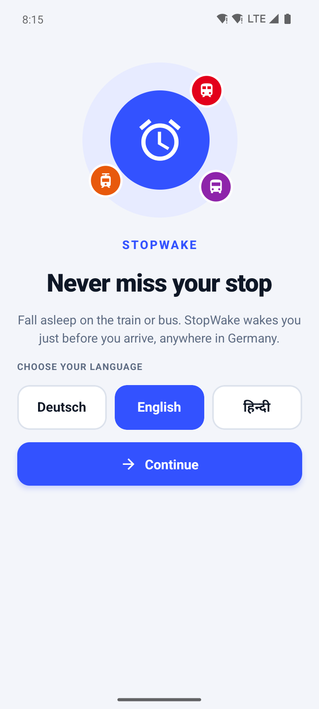
  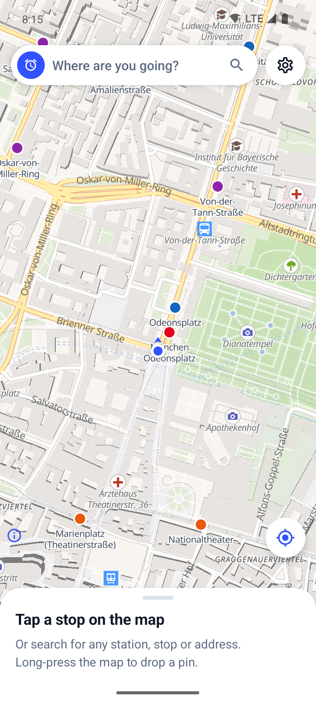
  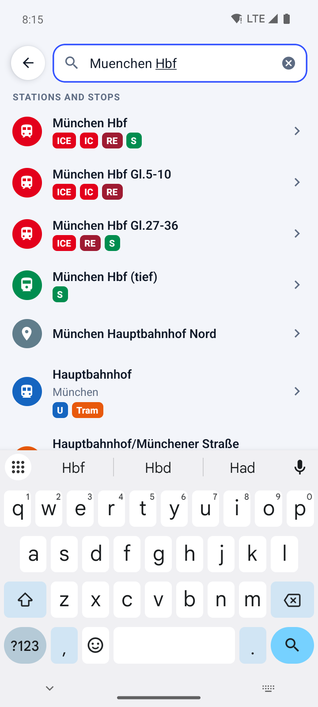
  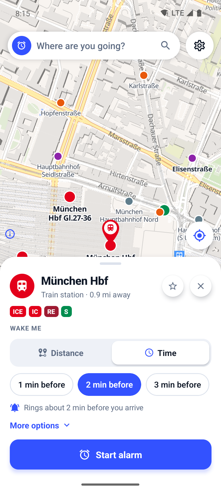
</p>
<p>
  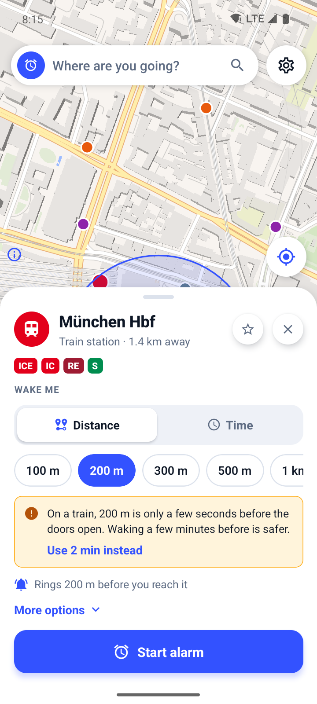
  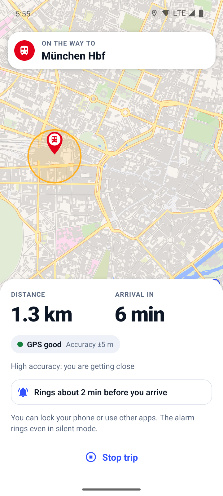
  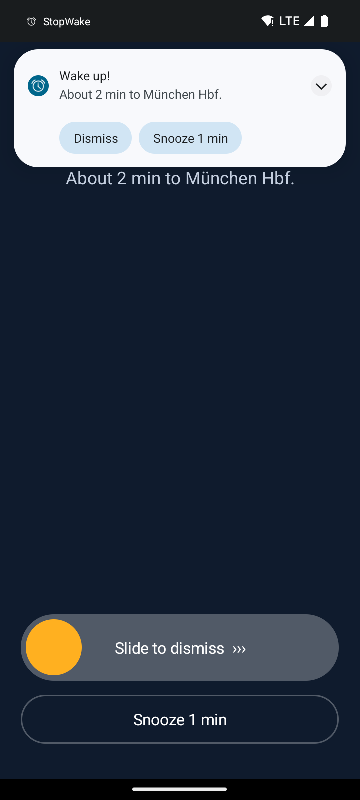
  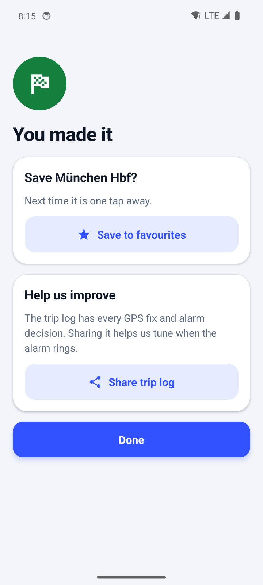
</p>
<p>
  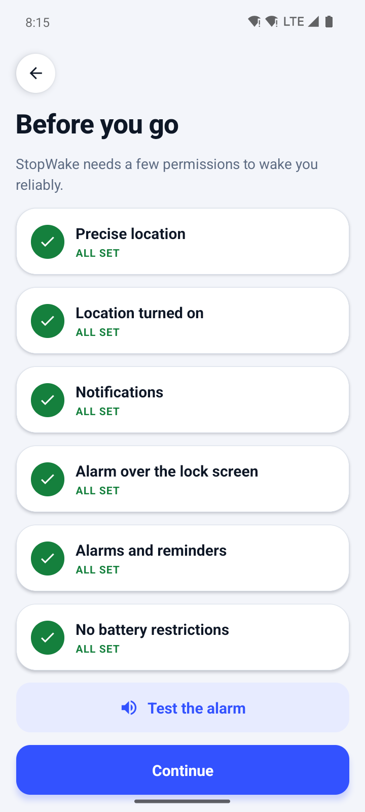
  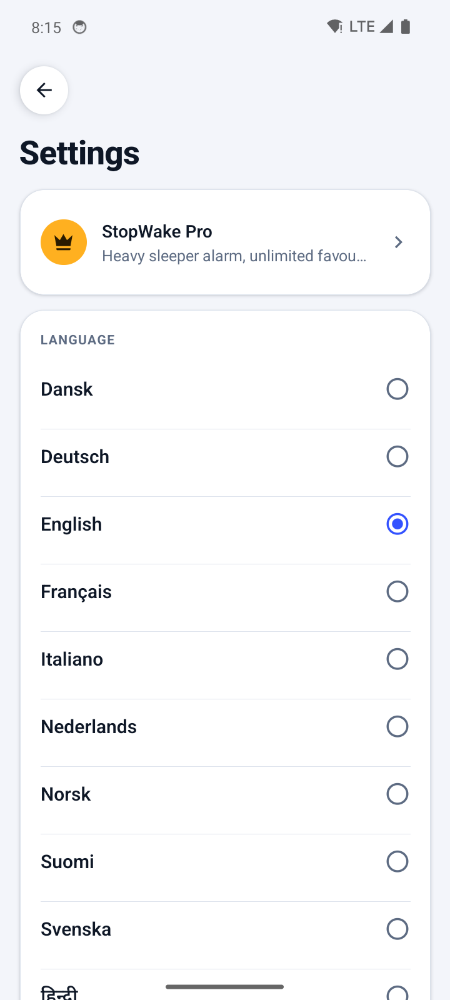
  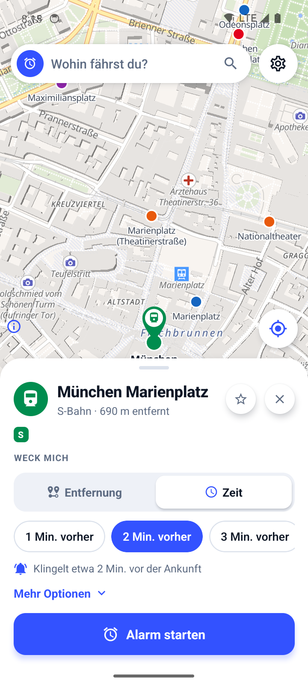
  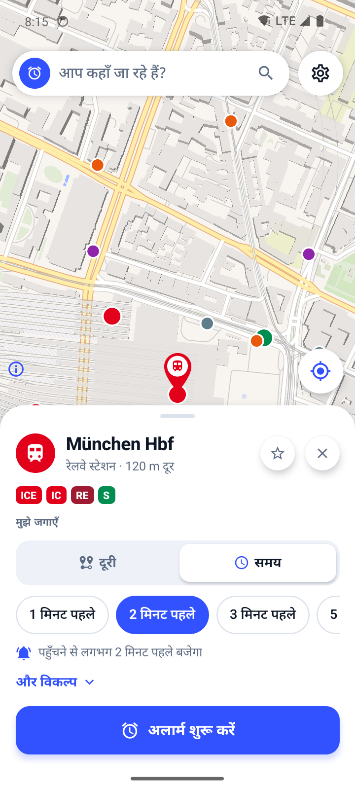
</p>

## Try it on a phone

1. Open the latest **Android** run under the repo's **Actions** tab and download the **StopWake-apk** artifact.
2. Unzip it and install the APK (allow installs from unknown sources when asked).
3. On first launch, pick your language, then fix everything the setup checklist marks red and play the test alarm.
4. Tap a stop on the map (or search for it) and press **Start alarm**.
5. After each real trip, use **Share trip log** on the last screen. The logs are what we tune on.

## How it works

```
 App (Expo / React Native)                Native Android (modules/trip-alarm)
 ─────────────────────────                ────────────────────────────────────
 Map (MapLibre, OpenFreeMap)              TripService  (foreground service, type "location")
 Stops DB (SQLite, offline)  ─ startTrip ▶  │  GPS + network fixes (LocationManager)
 Search, sheet, live trip    ◀─ events ──   ▼
 de / en / hi                             TripEngine  (pure Kotlin, unit tested)
                                            │  trigger rules · adaptive rate · watchdog
                                            ▼
                                          AlarmPlayer + AlarmActivity  (texts in de / en / hi)
                                            alarm stream, escalating, over the lock screen
```

Everything that decides when to ring runs natively, inside a foreground service that keeps
working with the app closed. JavaScript draws the screens. There is no backend; nothing leaves
the phone except map tiles and address searches. Stop search and the stops on the map come from
a database inside the app, so picking a stop works without a connection.

**Permissions.** The trip starts while the app is open, so Android grants location to the
service with plain *while using the app* permission. The app never asks for background
("all the time") location, which avoids the Play Store's background-location review.

### Stops

`npm run build:stations` turns the [db-hafas-stations](https://github.com/derhuerst/db-hafas-stations)
list (DB InfraGO and OpenStreetMap data) into `assets/stations/germany-stops.db`, a 20 MB SQLite
file with a full-text index. Entries with the same name within 400 m are merged into one stop.
Each stop keeps its transport types (ICE, IC, RE/RB, S, U, tram, bus, ferry) and a rank based on
how busy it is. The rank decides which stops show at low zoom and breaks ties in search together
with the distance from you. The file is generated, not committed: run the script after
`npm install`, and CI runs it before every build.

### When it rings (arrive mode)

The first of these wins:

1. A fix lands inside the radius.
2. Two consecutive fixes straddle the radius. At 300 km/h a train covers 415 m between fixes and can skip a small circle.
3. The estimated time of arrival drops below the "minutes before" setting.
4. You came close and are now moving away. This catches a pin placed off the actual route; the alarm offers **Not yet, keep tracking**.
5. GPS went quiet (tunnel, underground) and dead reckoning from the last speed says you have arrived. This alarm also offers **Not yet**.

Coarse cell-tower fixes cannot ring a small circle. For the minutes trigger they count only
when their error is worth under 30 seconds of travel. With **wake by time**, a 300 m circle
around the stop stays armed as a backstop.

### Tracking rate

| Distance to the stop | Fixes | Why |
| --- | --- | --- |
| Far (> 20 km and > 30 min) | GPS every 2 min, network every 1 min | Battery on long trips |
| Middle (5–20 km or < 30 min) | Every 30 s | ETA becomes meaningful |
| Near (< 5 km or < 15 min) | GPS every 5 s, CPU kept awake | Never overshoot the radius |

The "minutes before" setting moves these boundaries out. A watchdog notices when fixes stop
arriving. It runs on a Handler, backed by an AlarmManager alarm that also fires in doze or
after Android killed the app. If the app was killed or the phone rebooted mid-trip, you get a
"Tracking stopped" alarm instead of silence.

## Develop

```bash
npm install
npm run build:stations # generate the offline stops database (about 5 s)
npm run check          # typecheck, lint, JS tests (the search tests use the generated database)
npm run test:engine    # trip engine tests on the JVM, including 1000 simulated trips
npx expo run:android   # build and run on a connected phone (needs the Android SDK)
```

**On an emulator.** The **Screenshots** workflow (Actions tab, *Run workflow*) builds the app,
boots an Android emulator and drives it with [Maestro](https://maestro.dev) through `e2e/`:
first start, setup, map, search, a trip to München Hbf with a simulated GPS ride, the alarm,
settings and the other languages. It commits the screenshots to `docs/screenshots/`, and a failed
step leaves a `debug-*.png` of the screen it stopped on.

The engine tests need only a JDK. They compile the engine sources from the Android module and
replay synthetic trips with GPS noise, station stops and tunnels. Any change to the trigger
rules should keep them green, and a missed stop seen on a real trip should become a new scenario
in `TripEngineTest`.

**Languages.** The app's texts live in `src/i18n/{en,de,hi}.ts`; `en.ts` defines the keys and
the other two must have every key with the same `{placeholders}` (a test checks this). The
alarm screen and notifications are drawn natively, so their texts are in `L10n.kt`. The app
sends the chosen language to the native side on start and whenever it changes.

```
App.tsx                      screen flow
src/screens/                 Onboarding, Home (map, sheet, search), Setup, Tracking, Done, Settings
src/map/                     home map, trip map, GeoJSON helpers
src/lib/stations/            stops database: spelling rules, search, nearest stop
src/lib/                     address search, wake options, formatting, local storage
src/i18n/                    English, German, Hindi
src/ui/                      theme, colours, shared components
tools/build-stations.ts      builds assets/stations/germany-stops.db
e2e/                         emulator flows and the screenshot script (Maestro)
modules/trip-alarm/
  android/…/tripalarm/       TripService, AlarmPlayer, AlarmActivity, receivers, L10n, JS bridge
  android/…/engine/          TripEngine, SpeedEstimator, Geo (no Android imports)
  engine-tests/              JVM test project for the engine
  src/                       typed JS wrapper
```

## Data and credits

- Map © [OpenStreetMap](https://www.openstreetmap.org/copyright) contributors, tiles by
  [OpenFreeMap](https://openfreemap.org) using the OpenMapTiles schema.
- Stops: DB InfraGO AG ([CC BY 4.0](https://creativecommons.org/licenses/by/4.0/)) and
  OpenStreetMap contributors ([ODbL](https://opendatacommons.org/licenses/odbl/)), via
  db-hafas-stations.
- Address search: [Photon](https://photon.komoot.io) by Komoot.

The same credits are shown in the app under **Settings → About and data**.
